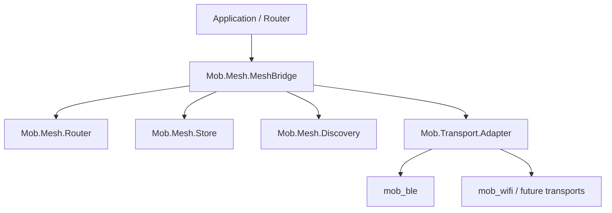

# mob_mesh

[](https://github.com/dl-alexandre/mob_mesh/actions/workflows/ci.yml)

`mob_mesh` is the multi-hop mesh transport layer for the `mob` ecosystem. It
sits above point-to-point transport plugins such as `mob_ble` or future WiFi
plugins and exposes its own `Mob.Transport` bridge.

Related projects:

- [`mob`](https://github.com/GenericJam/mob)
- [`mob_dev`](https://github.com/GenericJam/mob_dev)
- [`mob_transport`](https://github.com/dl-alexandre/mob_transport)
- [`mob_ble`](https://github.com/dl-alexandre/mob_ble)

The initial implementation provides:

- `Mob.Mesh.MeshBridge`, a `Mob.Transport` implementation.
- Basic epidemic flooding with TTL.
- Duplicate suppression.
- Process-local store-and-forward queue for offline destinations.
- Discovery state for peers learned from underlying transports.

## Architecture



`MeshBridge` owns the underlying transport adapters and receives normalized
`Mob.Transport` events. `Router` chooses direct, flood, or store decisions.
`Store` keeps offline messages in memory. `Discovery` tracks visible peers.

## Usage

```elixir
{:ok, mesh} =
  Mob.Mesh.start_link(
    event_target: self(),
    node_id: "device-a",
    transports: [
      {:ble, Mob.Ble.MobileBridge, transport_opts: [some: :option]}
    ]
  )

:ok = Mob.Mesh.send_message(mesh, "device-b", "hello")
```

Applications using `Mob.Transport.Adapter` can wrap `Mob.Mesh.bridge_module()`
like any other transport implementation.

## Supervision

For production apps, pass a stable `:node_id` and run the bridge under your
supervision tree:

```elixir
children = [
  {Mob.Mesh.MeshBridge,
   event_target: self(),
   node_id: "persisted-device-id",
   transports: [
     {:ble, Mob.Ble.MobileBridge, transport_opts: []}
   ]}
]

Supervisor.start_link(children, strategy: :one_for_one)
```

`Mob.Mesh.Supervisor` is also available when you want a one-bridge supervisor:

```elixir
Mob.Mesh.start_supervised(
  event_target: self(),
  node_id: "persisted-device-id",
  transports: [{:ble, Mob.Ble.MobileBridge, transport_opts: []}]
)
```

## Configuration

- `:event_target` - required process that receives canonical transport events.
- `:node_id` - stable local mesh identity. If omitted, a process-local test ID
  is generated.
- `:transports` - list of `{name, transport_module, opts}` or
  `{name, transport_module}` entries.
- `:seen_limit` - maximum duplicate-suppression IDs retained. Defaults to
  `4_096`.
- `:store_opts` - options for the in-memory store. `:limit` defaults to `1_000`.
- Send option `:ttl` - relay depth for a message. Defaults to `8`.
- Send option `:message_id` - override the generated message ID, mainly useful
  for tests.

## When To Use It

Use `mob_mesh` when an application needs best-effort delivery across peers that
may not have direct connectivity. Use a direct transport such as `mob_ble` when
the destination is always one hop away or when battery and bandwidth are more
important than reach.

## Mobile Notes

The current router uses epidemic flooding. Keep TTL low on BLE-heavy mobile
networks, keep payloads compact, and tune scan/advertising intervals in the
underlying transport. See [Performance](docs/PERFORMANCE.md) for more detail.

## Security

The mesh envelope is currently a routing container, not a security boundary.
Sign or encrypt application payloads before sending sensitive data. See
[Security](docs/SECURITY.md).
